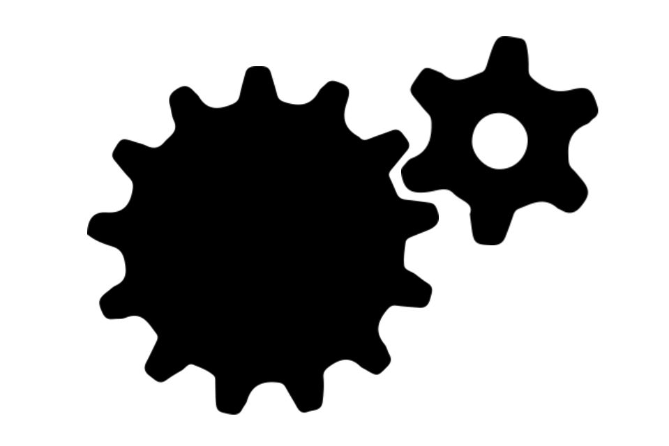
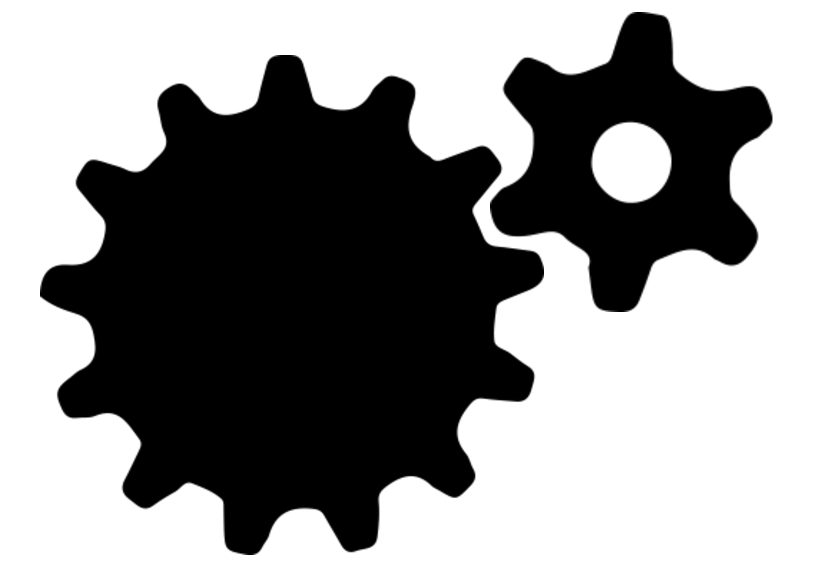

This is just a fun little CSS and JQuery animation I made in my free time

What this does is just rotate your gears as if they were actually running when you hover over them!

## Images

First we're going to need some gears!
Here are the two png's I'll be using


## HTML
Let's drop these guys in our html markup

```html
<div class="gears">
	>PATH TO IMAGE<<">
	>PATH TO IMAGE<<">
</div>

```
- Here we are creating a div container to hold our images.
- This is necessary because we are going to use absolute positioning on our images to put them together, but we still want to control their flow in the page.
- We have inside this class two images, one for our big and small gear.

## CSS
Next let's create some css styling so that our gears interlock

```css
.gears {
	position: relative;
	height: 600px;
	width: 740px;
	margin: auto;
}

.gears #big {
	margin-top: 43px;
	height: 500px;
	width: auto;
	position: absolute;
}
.gears #small {
	margin-left: 450px;
	height: 300px;
	width: auto;
	position: relative;
}
```
- Here we are just using a margin to position these two images ontop of eachother.


- It should look something like this

Next we will have to add some keyframe animations so that we can rotate the gears

```css
.rotate-big {
	animation-name: rotate_big;
	animation-duration: 4s;
	animation-iteration-count: infinite;
	animation-timing-function: linear;
}

.rotate-small {
	animation-name: rotate_small;
	animation-duration: 1.8462s;
	animation-iteration-count: infinite;
	animation-timing-function: linear;
}


@-webkit-keyframes rotate_big {
	from{-webkit-transform:rotate(0deg);}       
    to{-webkit-transform:rotate(360deg);}
}
@-webkit-keyframes rotate_small {
	from{-webkit-transform:rotate(360deg);}       
    to{-webkit-transform:rotate(0deg);}
}
```

- Here we are adding two animations.
	1. an animation for the big gear
	2. an animation for the small gear
- each have:
	- a duration (time it takes to complete one animation cycle)
	- an iteration count, here set to infinite so that it keeps going
	- and a timing function, here set to linear so that the animation is constant throughout each iteration
- We also setup the keyframes to perform a transform rotate.
	- the big gear rotates clockwise (0 - 360)
	- the little gear rotates counterclockwise (360 - 0)
- We need to do a little math to set the time it takes for each gear to complete one animation. 
	- For this we just need to know the ratio of each gears teeth.
	- So we can divide the amount of teeth on whichever gear we want to 'drive' the rotation by the amount of teeth of the other gear.
	- So in the case of these gears we have the big gear with 13 teeth driving the little gear with 6 teeth.

    13 / 6 = 2.1666

    - Now we just need to decide how long it should take our big gear to complete one rotation.
    - Here I've chosen 4 seconds
    - So the amount of time it should take our smaller gear to rotate in this time is:

    4 / 2.1666 = 1.8462

    - So we set the rotation duration for our big and small gears this way.

## JQuery

The last step here is just to make these gears turn when we hover over them!

```JQuery
$(document).ready(function(){
    $('.gears').hover(function() {
        $("#big").addClass('rotate-big');
        $("#small").addClass('rotate-small');
    },
    function() {
        $("#big").removeClass('rotate-big');
        $("#small").removeClass('rotate-small');
    });
  });
```

- Here we are just addeing our rotate class for each of the gears on hover, and removing it when we are not hovering.
- Without the class, the keyframes cannot fire, so this is a good way to control when the animation occurs. 
- This is optional, otherwise we can just have the gears rotate freely forever!



## Disclaimer

**One thing to keep in mind is that the math we used on the gears is not 100 percent accurate.**
**The longer the gears run, eventually they will desync as it is a decimal number.**
**To fix this we could consider using math in our calculation of duation. Something further to think about!**


